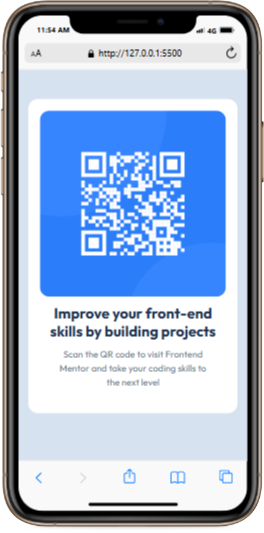

# Frontend Mentor - QR code component solution

This is a solution to the [QR code component challenge on Frontend Mentor](https://www.frontendmentor.io/challenges/qr-code-component-iux_sIO_H). Frontend Mentor challenges help you improve your coding skills by building realistic projects.

## Table of contents

- [Overview](#overview)
  - [Screenshot](#screenshot)
  - [Links](#links)
- [My process](#my-process)
  - [Built with](#built-with)
  - [What I learned](#what-i-learned)
  - [Continued development](#continued-development)
- [Author](#author)

## Overview

### Screenshot



### Links

- Solution URL: [https://github.com/0xelochukwu/QR-code-component](https://github.com/0xelochukwu/QR-code-component)
- Live Site URL: [https://qr-code-component-zeta-taupe-79.vercel.app/](https://qr-code-component-zeta-taupe-79.vercel.app/)

## My process

### Built with

- Semantic HTML5 markup
- CSS custom properties
- Mobile-first workflow

### What I learned

the project loked simple but i used it to start off my mobile-first web develpment approach.

```css
@media (min-width: 576px) {
  .main-container {
    max-width: 540px;
  }
}

@media (min-width: 768px) {
  .main-container {
    max-width: 720px;
  }
}

@media (min-width: 992px) {
  .main-container {
    max-width: 960px;
  }
}

@media (min-width: 1200px) {
  .main-container {
    max-width: 1140px;
  }
}
```

### Continued development

- mobile-fist design
- time and places to use em and rem
- differences between max-width and min-width

## Author

- Frontend Mentor - [@0xelochukwu](https://www.frontendmentor.io/profile/0xelochukwu)
- Twitter - [@0xelochukwu](https://www.twitter.com/0xelochukwu)
